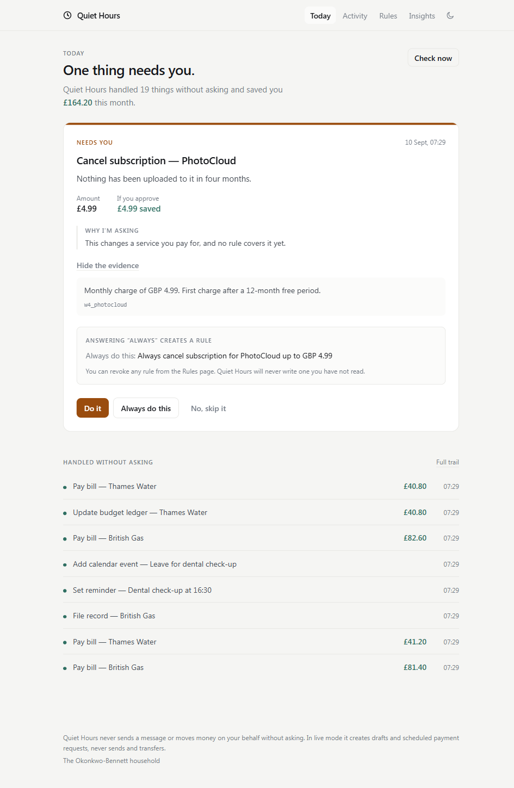
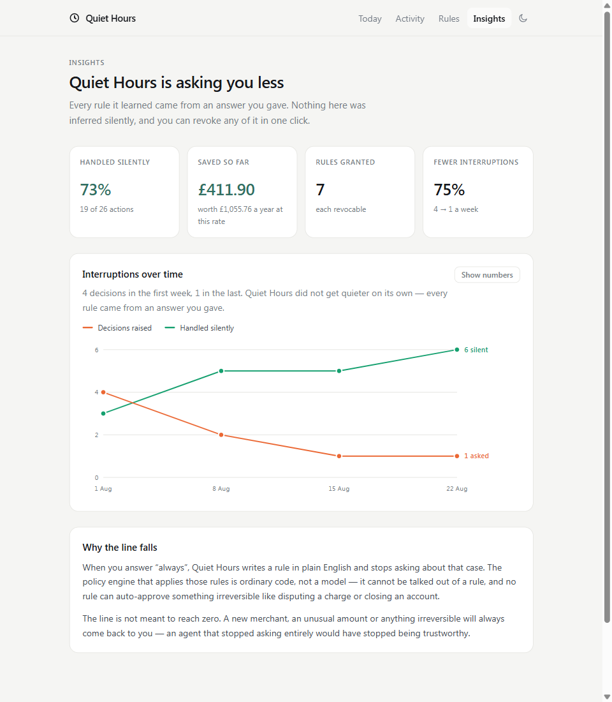
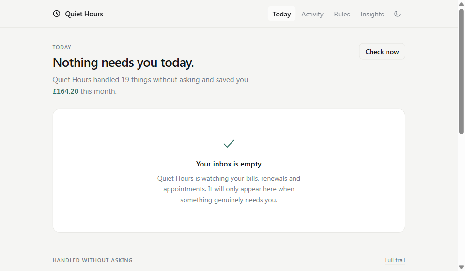
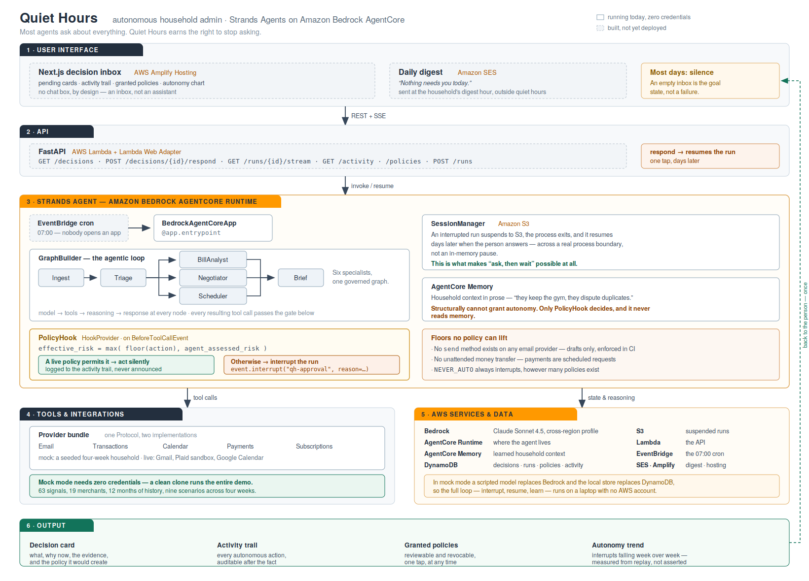

# Quiet Hours

**An agent that handles your household admin and only interrupts you when there's a decision only you can make.**

Built with the [Strands Agents SDK](https://strandsagents.com) for the AWS *Agents for Humans* hackathon — **Everyday Agents** track.

> Most agents ask you about everything. Quiet Hours earns the right to stop asking.



*One card, because one thing needed a person. Everything under it was handled without
asking — and every line of it is in the trail, with the reasoning that produced it.*

---

## The problem

Last year one of us paid **£456 for a gym cancelled in March**. Not because the money didn't matter — because cancelling was a four-minute job, and four-minute jobs are exactly the ones that never get done.

The average household runs about twelve subscriptions and eight recurring bills. Each occasionally needs something: a price goes up, a trial converts, a charge lands twice, an appointment needs moving. Individually minor. Together, hours a month — and the real cost isn't the time, it's what you keep paying for things you no longer use.

The usual answer is an app. But an app just moves the work: now you have to remember to open the thing that reminds you.

## Who it's for

People with no slack in their week. New parents. Carers. Anyone working two jobs. The people for whom *"just review your statements each month"* was never a realistic instruction.

## How it works

Quiet Hours has no app to open. It wakes on a schedule, reads what came in, and does the work.

1. **Ingest** — new emails, card transactions and calendar events since the last run.
2. **Triage** — a Strands multi-agent graph classifies and correlates them into *findings*: a price increase, a converting trial, a duplicate service, an unused subscription, a double charge.
3. **Specialists act** — a bill analyst compares against twelve months of history, a negotiator drafts cancellations and disputes, a scheduler handles calendar work.
4. **The policy gate** — every proposed action passes through a Strands hook on `BeforeToolCallEvent`. Reversible, low-risk work executes silently and is logged with its reasoning. Anything that spends money, sends a message or cancels a service raises a **decision card**.
5. **You decide** — one tap. The agent resumes and finishes the job.

### The part that makes it different

**Autonomy is earned, not assumed.**

Approving an action can create a policy — and the card shows you the rule in plain English *before* you grant it: *"This will also mean: always auto-pay British Gas under £150."* The policy engine then handles that class of action silently on every future run.

Over four weeks the agent's interrupt rate falls from **four decisions in week one to one in week four** — 75% fewer interruptions — while the number it handles on its own rises from **three a week to six**.

Every policy is listed, counted, and revocable in one click. And some things — disputing a charge, closing an account — **no policy can ever auto-approve**. That's enforced in code, not in a prompt.



*Both lines are counted from the audit trail of four real runs, not authored. The line is
not meant to reach zero — an agent that stopped asking entirely would have stopped being
trustworthy.*

### And on a good day, this



*The empty state is the goal, not a failure. It is the screen this whole product is
trying to earn.*

## Try it now, without installing anything

**[mikhil-sec.github.io/Agents_for_Humans-Hackathon](https://mikhil-sec.github.io/Agents_for_Humans-Hackathon/)**

The real screens, running entirely in your browser against a recorded agent run — no
backend, no account, nothing to install. Answering a card works: it leaves the inbox,
creates the rule the button previewed, and moves the autonomy chart. Your answers are
local to your tab and reset when you close it.

What it is not is the agent. The loop that produced that data — interrupt, suspend,
resume, learn — needs a process, and that is what `make demo` below runs.

## Or run the whole thing in 90 seconds

Mock mode runs the complete product, agent included, with **no AWS account and no
credentials**, against a seeded four-week household history.

```bash
git clone https://github.com/Mikhil-sec/Agents_for_Humans-Hackathon.git
cd Agents_for_Humans-Hackathon
make install
make demo
```

Then open <http://localhost:3000>, and in a second terminal:

```bash
make agent          # trigger a run
```

## Architecture



Solid boxes run today from a clean clone with no credentials. Dashed boxes are
built but not yet deployed. The source is
[`architecture.svg`](docs/assets/architecture.svg) — editable in any vector tool
and diffable in git.

Full walkthrough: **[docs/ARCHITECTURE.md](docs/ARCHITECTURE.md)**.

### How we use Strands

| Feature | What it does here |
|---|---|
| `GraphBuilder` | The triage → specialists → brief pipeline |
| `HookProvider` on `BeforeToolCallEvent` | The policy gate. Every tool call is governed, including ones the model improvises — safety is structural, not a request in a prompt. |
| `event.interrupt()` | Raises a decision card and suspends the run |
| Durable `SessionManager` (S3) | The suspended run survives process exit and resumes days later, exactly where it stopped |
| `structured_output_model` | Typed `Finding` and `ProposedAction` objects, not JSON scraped from prose |
| `invocation_state` | Household context reaches tools and hooks without entering the model's context |
| MCP clients | DuckDuckGo for price benchmarking; Playwright for real cancellation flows |

### AWS services

Bedrock (Claude Sonnet 4.5) · **AgentCore Runtime** · **AgentCore Memory** · AgentCore Gateway · Lambda · DynamoDB · S3 · EventBridge · SES · Amplify · Secrets Manager

### Why the interrupt is the interesting part

A scheduled agent runs at 07:00 while you're asleep. Blocking on an input prompt is useless. So instead:

1. The run reaches a decision it shouldn't make alone and calls `event.interrupt()`.
2. We persist a decision card, mark the run `waiting_on_user`, and **the process exits.** Nothing is held open; nothing accrues cost.
3. Hours or days later you tap "Cancel it".
4. Strands rehydrates the session from S3 and the tool call resumes **exactly where it stopped**, with its full context intact.

## Safety

This is an agent with visibility into someone's email and money, so:

- **It never sends email.** In live mode it creates *drafts*. The Gmail provider has no send method — the absence of the code is the guarantee.
- **It never moves money unattended.** It creates *scheduled payment requests* a human confirms.
- **Irreversible actions always ask.** No policy can auto-approve a `NEVER_AUTO` action; enforced in [`agent/quiet_hours_agent/policy.py`](agent/quiet_hours_agent/policy.py) and covered by a named test.
- **Nothing happens invisibly.** Every action, autonomous or not, is written to the activity trail with its reasoning and evidence.
- **The policy engine contains no LLM call.** Learned autonomy has to be auditable and revocable, and a prompt can be argued out of a safety rule where an `if` statement cannot.

## Project layout

```
contracts/     frozen shared types — Python source of truth + TypeScript mirror
agent/         Strands agents, graph, tools, policy engine        (Lane A)
api/           FastAPI backend                                    (Lane B)
web/           Next.js decision inbox                             (Lane B)
integrations/  providers, mock and live                           (Lane C)
fixtures/      the seeded four-week household                     (Lane C)
infra/         CDK, AgentCore deployment                          (Lane C)
docs/          architecture, contracts, lane briefs, status
```

## Contributing

Three people work on this in parallel. If you're picking up work — human or AI assistant — start with:

1. **[AGENTS.md](AGENTS.md)** — the rules, read by every AI coding assistant
2. **[docs/AI_AGENT_PROTOCOL.md](docs/AI_AGENT_PROTOCOL.md)** — which files you may touch
3. **[docs/lanes/](docs/lanes/)** — your lane brief
4. **[docs/CONTRACTS.md](docs/CONTRACTS.md)** — the frozen shared surface

## Licence

[MIT](LICENSE).

## Acknowledgements

Built with [Strands Agents](https://strandsagents.com) and [Amazon Bedrock AgentCore](https://aws.amazon.com/bedrock/agentcore/). Fixture data is entirely synthetic — no real household's data appears anywhere in this repository.
